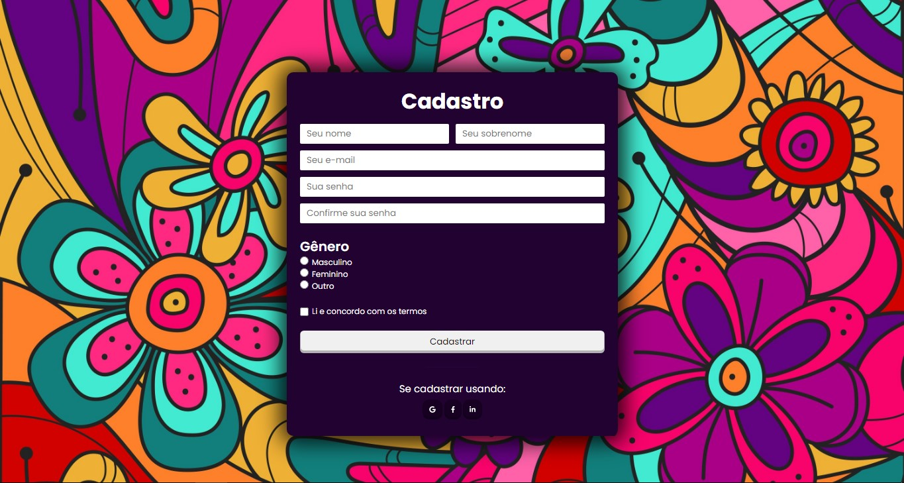
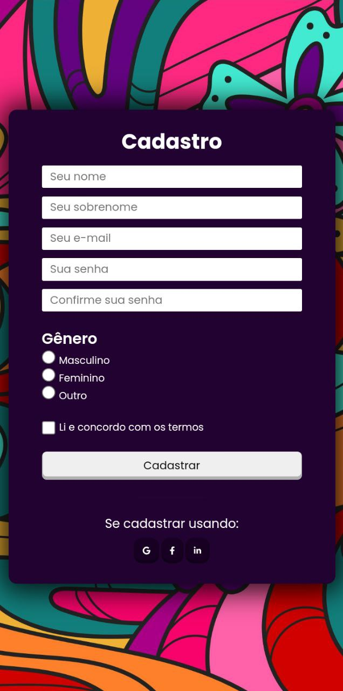

# Página de Cadastro
## Descrição 
Olá, espero que todos estejam bem😁😀!! Nesse projeto decidi colocar meus conhecimentos sobre formulário em prática criando uma página de cadastro bem simples e responsiva, usando apenas HTML5 e CSS3. Também utilizei algumas animações básicas com CSS. 🚀 

## Validação
O formulário em si não tem nenhuma validação, é apenas para treino das tecnologias citadas acima. ✅

## Dificuldades
Minha maior dificuldade foi colocar os dois primeiros inputs na mesma linha, porém contornei isso utilizando o CSS Flexbox. Coloquei ambos dentro de uma div com width de 50%.🏋️‍♀️
## Tecnologias Utilizadas
- HTML5
- CSS3

